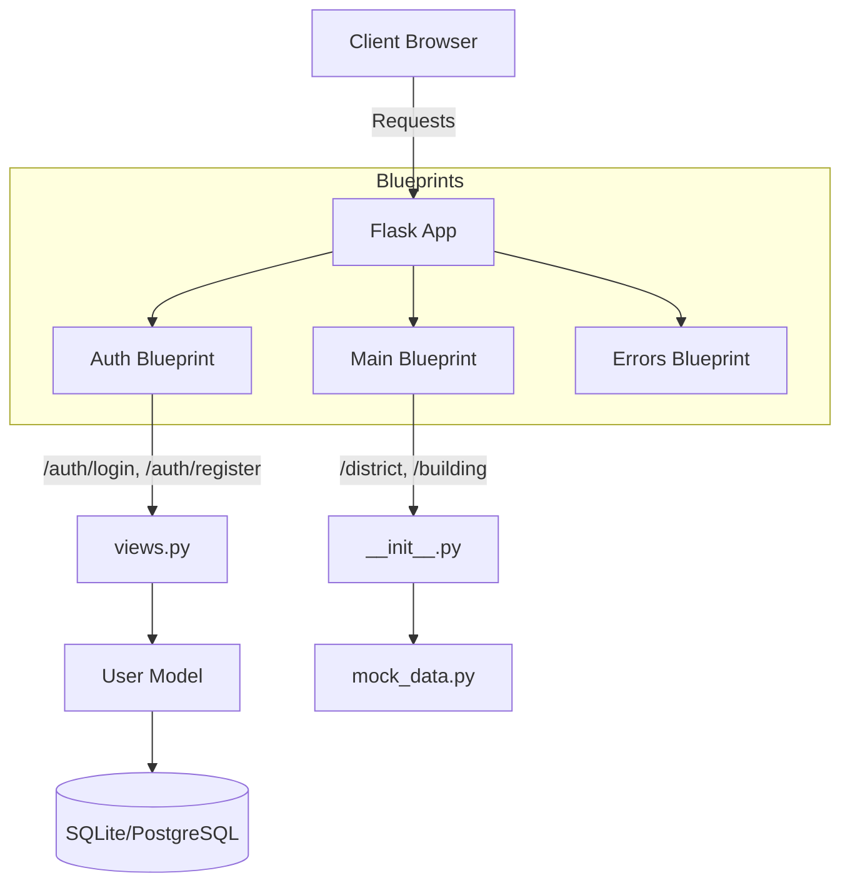

# Architecture Guide

## System Overview
이 프로젝트는 유지보수성과 확장성을 최대화하기 위해 **Flask Application Factory Pattern**을 채택하고 있습니다. 전역 상태를 최소화하고, 설정(`config.py`)에 따라 애플리케이션 인스턴스를 동적으로 생성합니다.

### Application Factory (`app/__init__.py`)
- **`create_app(config_name)`**: 애플리케이션의 진입점입니다.
- **역할**:
    - Flask 앱 인스턴스 생성
    - 설정 로드 (`app.config.from_object`)
    - Flask 확장 초기화 (`db`, `migrate`, `login_manager`)
    - 블루프린트 등록 (`auth`, `main`)
    - 전역 로깅 및 에러 핸들링 설정

---

## Component Diagram (Blueprints)
기능 단위로 코드를 분리하여 관리하는 **Blueprint** 구조를 사용합니다.

### 1. Auth Blueprint (`app/auth`)
- **목적**: 사용자 인증 및 세션 관리.
- **주요 파일**:
    - `views.py`: 로그인/로그아웃 로직 처리.
    - `forms.py`: Flask-WTF를 이용한 입력 폼 정의 및 검증.

### 2. Main Blueprint (`app/main`)
- **목적**: 메인 대시보드 화면 및 데이터 제공.
- **주요 파일**:
    - `__init__.py`: 라우트 정의 및 API 응답 반환.
    - `mock_data.py`: 시연용 가짜 데이터 정의.

---

## Data Flow
데이터가 시스템을 통과하는 흐름은 다음과 같습니다.

1.  **Request Ingestion**: Flask 앱이 요청을 수신하고 URL 규칙에 따라 적절한 Blueprint로 라우팅합니다.
2.  **Form Validation** (Auth): 사용자 입력이 있는 경우 `forms.py` 클래스를 통해 데이터 유효성을 검증합니다.
3.  **Business Logic**:
    - **Auth**: `User` 모델을 통해 DB에서 사용자 정보를 조회하거나 생성합니다.
    - **Main**: `mock_data.py` 또는 DB에서 시각화할 데이터를 가져옵니다.
4.  **Response Generation**:
    - **HTML**: Jinja2 템플릿을 렌더링하여 반환합니다 (서버 사이드 렌더링).
    - **JSON**: `app/utils`의 헬퍼 함수를 통해 표준 포맷의 JSON을 반환합니다 (클라이언트 사이드 렌더링 지원).
